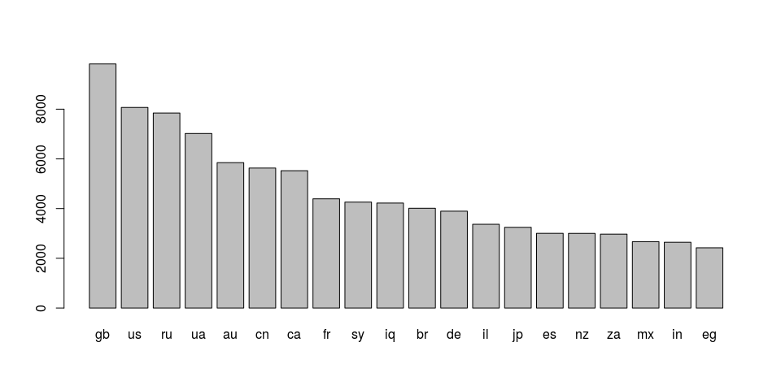

Newsmap: geographical news classifier
=====================================

Semi-supervised Bayesian model for geographical document classification. Its [online version](http://newsmap.koheiw.net) has been working since 2011. It has first been in Python, but recently implemented in R. This program automatically construct a large geographical dictionary from a corpus of news stories for accurate classification. Currently, the **newsmap** package contains seed dictionaries for *English*, *German*, *Spanish*, *Japanese*, *Russian* documents.

The detail of the algorithm is explained in [Newsmap: semi-supervised approach to geographical news classification](http://www.tandfonline.com/eprint/dDeyUTBrhxBSSkHPn5uB/full). **newsmap** has also been used in recent social scientific studies:

-   Kohei Watanabe, 2017. "[Measuring News Bias: Russia’s Official News Agency ITAR-TASS’s Coverage of the Ukraine Crisis](http://journals.sagepub.com/eprint/TBc9miIc89njZvY3gyAt/full)", *European Journal Communication*
-   Kohei Watanabe, 2017. "[The spread of the Kremlin’s narratives by a western news agency during the Ukraine crisis](http://www.tandfonline.com/eprint/h2IHsz2YKce6uJeeCmcd/full)", *Journal of International Communication*
-   Tomila Lankina and Kohei Watanabe. 2017. ["Russian Spring’ or ‘Spring Betrayal’? The Media as a Mirror of Putin’s Evolving Strategy in Ukraine](http://www.tandfonline.com/eprint/tWik7KDfsZv8C2KeNkI5/full)", *Europe-Asia Studies*

How to install
--------------

This package is not upload to CRAN, so please install by running this command in R. You need to have **devtools** installed beforehand.

``` r
install.packages("devtools")
devtools::install_github("koheiw/newsmap")
```

Example
-------

In this example, using a text analysis package [**quanteda**](https://quanteda.io) for preprocessing of textual data, we train a geographical classification model on a corpus of news summaries collected from Yahoo News via RSS in 2014.

### Download example data

``` r
download.file('https://www.dropbox.com/s/e19kslwhuu9yc2z/yahoo-news.RDS?dl=1', '~/yahoo-news.RDS')
```

### Train Newsmap classifier

``` r
library(newsmap)
library(quanteda)
## Package version: 1.3.4
## Parallel computing: 2 of 8 threads used.
## See https://quanteda.io for tutorials and examples.
## 
## Attaching package: 'quanteda'
## The following object is masked from 'package:utils':
## 
##     View

# Load data
data <- readRDS('~/yahoo-news.RDS')
data$text <- paste0(data$head, ". ", data$body)
data$body <- NULL
corp <- corpus(data, text_field = 'text')

# Custom stopwords
month <- c('January', 'February', 'March', 'April', 'May', 'June',
           'July', 'August', 'September', 'October', 'November', 'December')
day <- c('Sunday', 'Monday', 'Tuesday', 'Wednesday', 'Thursday', 'Friday', 'Saturday')
agency <- c('AP', 'AFP', 'Reuters')

# Select training period
sub_corp <- corpus_subset(corp, '2014-01-01' <= date & date <= '2014-12-31')

# Tokenize
toks <- tokens(sub_corp)
toks <- tokens_remove(toks, stopwords('english'), valuetype = 'fixed', padding = TRUE)
toks <- tokens_remove(toks, c(month, day, agency), valuetype = 'fixed', padding = TRUE)

# Seed dictionaries supplied by this package
# English: data_dictionary_newsmap_en
# German: data_dictionary_newsmap_de
# Japanese: data_dictionary_newsmap_ja
# Spanish: data_dictionary_newsmap_es
# Russian: data_dictionary_newsmap_ru

label_toks <- tokens_lookup(toks, data_dictionary_newsmap_en, levels = 3) # level 3 is countries
label_dfm <- dfm(label_toks)

feat_dfm <- dfm(toks, tolower = FALSE)
feat_dfm <- dfm_select(feat_dfm, selection = "keep", '^[A-Z][A-Za-z1-2]+', valuetype = 'regex', case_insensitive = FALSE) # include only proper nouns to model
feat_dfm <- dfm_trim(feat_dfm, min_count = 10)
## Warning in dfm_trim.dfm(feat_dfm, min_count = 10): min_count is deprecated,
## use min_termfreq

model <- textmodel_newsmap(feat_dfm, label_dfm)

# Features with largest weights
coef(model, n = 7)[c("us", "gb", "fr", "br", "jp")]
## $us
##         US WASHINGTON   American Washington  Americans       YORK 
##  10.733869  10.031534   9.773099   9.496846   8.234697   6.951198 
##     States 
##   6.285434 
## 
## $gb
##   British    London    LONDON   Britain Britain's        UK    Briton 
## 10.939468 10.653923 10.647544 10.396778  9.754031  9.711121  7.533754 
## 
## $fr
##    French    France     PARIS     Paris     Valls Frenchman    CANNES 
## 11.348094 11.322555 10.448944 10.259995  8.005111  7.838057  7.742747 
## 
## $br
##    Brazil Brazilian       SAO     PAULO       RIO   JANEIRO       Rio 
##  11.63429  10.33501  10.28738  10.28285  10.21237  10.20553  10.09799 
## 
## $jp
##     Japan  Japanese     TOKYO     Tokyo       Abe     Abe's    Shinzo 
## 11.752176 10.938679 10.795813 10.101658  8.653831  8.065616  7.983856
```

### Predict geographical focus of texts

``` r
country <- predict(model)
head(country, 10)
## text63 text68 text69 text73 text78 text79 text84 text85 text86 text92 
##   "fr"   "us"   "ug"   "ng"   "es"   "es"   "sc"   "sc"   "bg"   "nz"
barplot(head(sort(table(country), decreasing = TRUE), 20))
```


